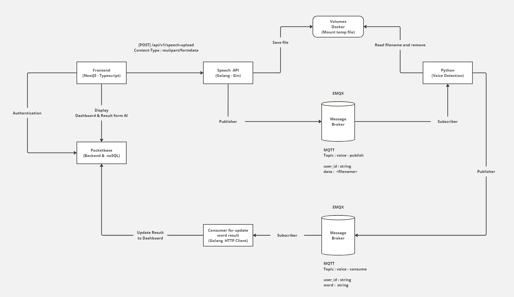

# X-Stack

This project was created for EN814710 Cloud Applications and Networking. \
One-Command Deployment. We provide a fast and easy deployment strategy.

# Members

| Member                | Student ID  |
| --------------------- | ----------- |
| Kamonwan Polrad       | 633040144-1 |
| Thachchaphan Yodsanga | 633040161-1 |
| Phakaphat Thongbu     | 633040420-3 |
| Sasithon Konthong     | 633040717-0 |

# Software Architecture



# Setting up

# Run with Docker Compose

Verify that Docker Compose is installed correctly by checking the version
(https://github.com/docker/compose/releases)

```bash
docker compose version

---Output---
Docker Compose version v2.23.3-desktop.2
```

Linux

```bash
docker compose up
```

Windows

```powershell
docker-compose up
```

If your have any problem when docker build

```bash
docker compose up --build
```

Check your task or application

```bash
docker compose ps
```

Tear down your application

```bash
docker compose down
```

## Usage

### Front-End ([NextJS](https://nextjs.org/docs/getting-started))

http://localhost:3000
| Username | Password |
|----------|------------|
| admin | 1234567890 |

### Back-End ([Pocketbase](https://pocketbase.io/))

http://localhost:8090/\_/
| Username | Password |
|------------------|------------|
| admin@xstack.com | 1234567890 |

### MQTT ([EMQX Dashboard](https://www.emqx.io/))

http://localhost:18083
| Username | Password |
|----------|----------|
| admin | public |

# Run with Docker Swarm

## Install Multipass on Linux

```bash
sudo snap install multipass

# Create a Ubuntu 22.04.1 LTS VM instances
multipass launch --name manager
multipass launch --name worker1
multipass launch --name worker2
```

Create a Swarm (Manager)

```bash
docker swarm init --advertise-addr <MANAGER IP Address>
```

Join to Swarm (Worker)

```bash
docker swarm join --token <TOKEN>

If you have problem when the worker nodes don't join to the swarm
docker swarm leave –-force
```

Check your Docker Swarm Cluster

```bash
docker node ls
```

## Deploy and check your application

```bash
docker stack deploy -c docker-compose.yaml x-stack
```

Check your task or application

```bash
docker service ls
```

Tear down your application

```bash
docker stack rm x-stack
```
